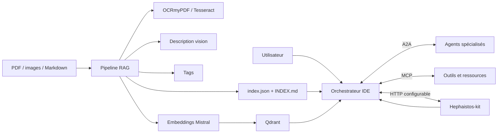

# Architecture A2A, Hephaistos et RAG multimodal

## Objectif

Cette tranche transforme le projet en noyau d’**AI Development Operating System** sans recréer les services déjà fournis par Hephaistos-kit.

La séparation retenue est volontaire :

- **A2A** relie les agents entre eux ;
- **MCP** relie un agent à ses outils, ressources et prompts ;
- **Hephaistos-kit** reste la mémoire unifiée et le watchdog du workspace ;
- **RAG Ingestion** transforme les fichiers en corpus consultable ;
- **Qdrant** conserve les vecteurs et les métadonnées de recherche.

## Flux principal



## Agent-to-Agent

Le noyau A2A introduit :

- validation d’`AgentCard` ;
- registre d’agents et recherche par tags de capacités ;
- cycle de vie de tâches avec transitions contrôlées ;
- messages, parties et artefacts ;
- client de découverte et d’envoi ;
- serveur HTTP local exposant :
  - `GET /.well-known/agent-card.json` ;
  - `POST /message:send` ;
  - `GET /tasks` ;
  - `GET /tasks/{id}` ;
  - `POST /tasks/{id}:cancel`.

Le streaming, les push notifications, les signatures JWS et l’OAuth ne sont pas déclarés comme terminés. Ils restent dans la roadmap afin de ne pas annoncer une conformité A2A v1 complète avant les tests d’interopérabilité.

## Adaptateur Hephaistos

Aucun stockage mémoire concurrent n’est créé. `HephaistosAdapter` agit comme une **anti-corruption layer** configurable :

- `health` vérifie que le service du workspace est présent ;
- `recall` récupère le contexte utile avant une tâche ;
- `unifiedContext` récupère l’état unifié du workspace ;
- `remember` enregistre un résultat après exécution ;
- `emitWatchdogEvent` transmet les événements de supervision.

Les routes par défaut sont des conventions et peuvent être remplacées. Le contrat réel de ton Hephaistos-kit devra être mappé dans `config/hephaistos.example.json` ou dans une configuration dédiée au workspace.

## Pipeline documentaire

Chaque ingestion suit ces étapes :

1. calcul SHA-256 du fichier source ;
2. extraction native du texte ;
3. OCR des PDF scannés avec OCRmyPDF ;
4. OCR des images avec Tesseract ;
5. extraction facultative des images d’un PDF avec `pdfimages` ;
6. description factuelle de chaque image par un endpoint vision compatible OpenAI ;
7. enrichissement par tags déterministes ;
8. découpage en chunks chevauchants ;
9. embeddings Mistral lorsque la clé est configurée ;
10. upsert Qdrant lorsque Qdrant est configuré ;
11. génération des fichiers de référence.

## Fichiers produits

```text
.ide-ai/rag/
├── index.json
├── INDEX.md
└── documents/
    └── <document-id>/
        ├── document.md
        └── manifest.json
```

`index.json` est l’index machine. Il contient notamment :

- identifiant stable du document ;
- chemin et checksum source ;
- type MIME ;
- tags ;
- nombre de chunks et d’images ;
- statut et dimension des embeddings ;
- collection vectorielle ;
- chemins vers le Markdown et le manifeste.

`INDEX.md` est la vue lisible rapidement par un humain ou un agent.

## Sécurité

- les clés restent dans les variables d’environnement ;
- les fichiers sources ne sont pas envoyés à un service vision sans configuration explicite ;
- Hephaistos est facultatif et aucun fallback mémoire caché n’est créé ;
- l’A2A de développement écoute uniquement sur `127.0.0.1` ;
- les payloads A2A sont limités à 2 Mio ;
- Qdrant conserve le texte du chunk et les métadonnées nécessaires à l’audit.
