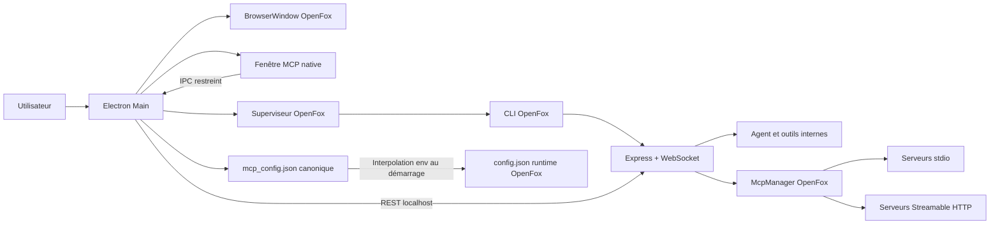

# Architecture — IDE Open AI

## Vue d’ensemble

## Décisions structurantes

1. **OpenFox reste le moteur agentique.** Le projet ne duplique ni le chat, ni le terminal, ni les sessions, ni le registre d’outils.
2. **Electron supervise un processus Node séparé.** Les modules natifs d’OpenFox (`better-sqlite3`, `node-pty`) restent chargés par Node et non par l’ABI Electron.
3. **Le runtime est isolé.** Electron fournit des répertoires `HOME`, `APPDATA`, `LOCALAPPDATA` et `XDG_*` dédiés.
4. **Le rendu n’a pas accès à Node.** `contextIsolation`, `sandbox` et une API IPC minimale sont imposés.
5. **Le fichier MCP canonique conserve les placeholders.** Les secrets `${env:VAR}` sont résolus avant le lancement du serveur et ne figurent pas dans l’export canonique.
6. **La limite de 100 outils est appliquée avant chaque activation.** Elle correspond au comportement documenté de Cascade/Windsurf.

## Flux de démarrage

1. Electron choisit un port localhost disponible.
2. Il initialise le profil OpenFox isolé et `auth.json` en stratégie locale.
3. Il lit `mcp_config.json`, valide les serveurs et résout les variables d’environnement.
4. Il injecte la configuration résolue dans le profil runtime OpenFox.
5. Il lance `openfox --no-browser` avec Node.js.
6. Il attend `/api/health` avant de charger l’interface dans la fenêtre principale.

## Limites du MVP

- Le transport SSE n’est pas implémenté par le `McpManager` OpenFox audité.
- OAuth MCP n’est pas implémenté.
- Les primitives MCP `resources` et `prompts` ne sont pas exposées à l’agent.
- Il n’existe pas encore de marketplace ni de signature des configurations.
